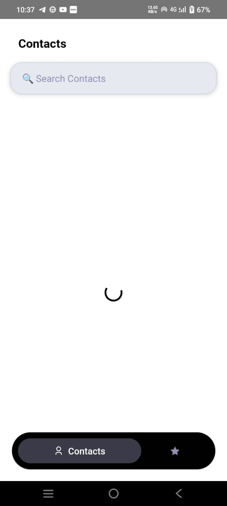
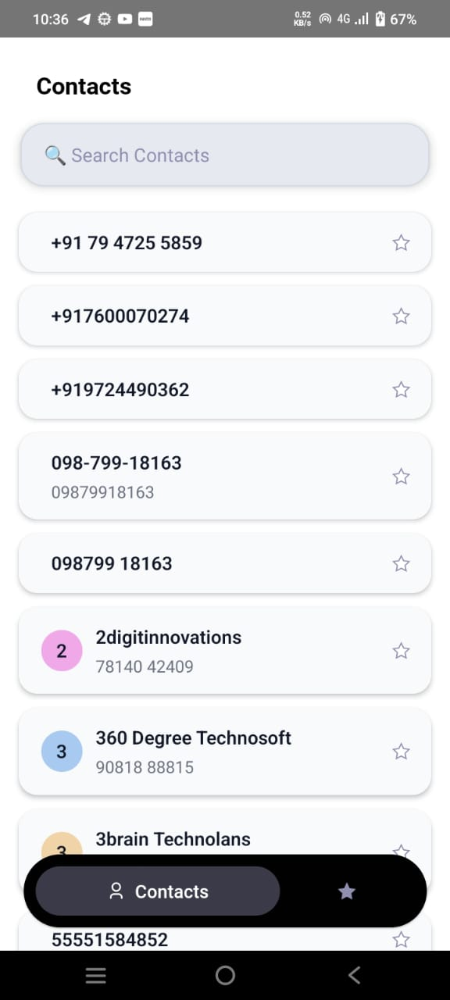
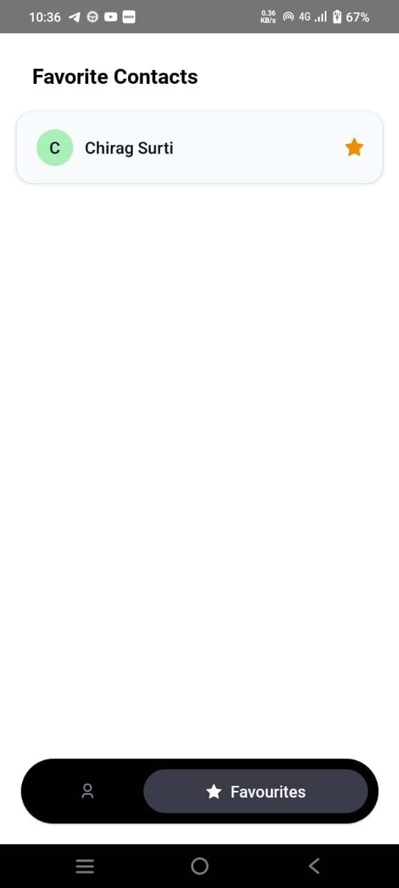

# React Native Contacts App 📱

This is a simple and elegant React Native app to view device contacts, mark favorites, and persist favorites using Redux Toolkit and AsyncStorage. It includes permission handling, Lottie animations, and dynamic avatar backgrounds.

## 🚀 Features

- 📇 Load device contacts with permission handling
- ⭐ Mark and unmark favorite contacts
- 💾 Favorites saved in AsyncStorage
- 🧠 Global state managed with Redux Toolkit
- 🎨 Random pastel-colored avatar initials
- 🎞️ Animated splash screen using Lottie
- 🧪 Typed with TypeScript

## 🛠️ Tech Stack

- React Native
- Redux Toolkit
- AsyncStorage
- react-native-contacts
- Lottie
- TypeScript

## 📷 Screenshots







## 🔧 Setup Instructions

1. **Clone the repository**
   ```bash
   git clone https://github.com/anjali67/Contacts-App.git
   cd ContactApp
